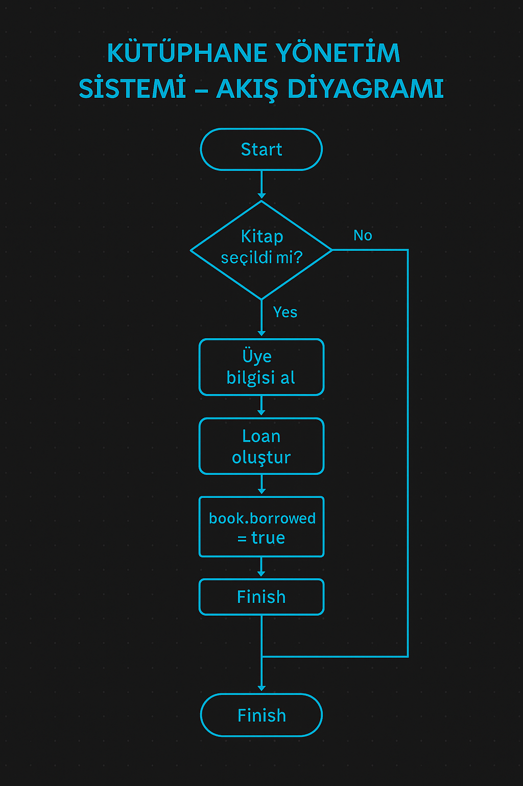

📚 Kütüphane Yönetim Sistemi – Java

Bu proje, Java kullanılarak geliştirilmiş basit ve işlevsel bir Kütüphane Yönetim Sistemidir.
Sistem, kitapların kaydedilmesini, üyelerin eklenmesini ve kitap ödünç alma / iade işlemlerinin yapılmasını sağlar.

Java’da OOP, Class Mantığı, Nesne Tabanlı Programlama ve ArrayList kullanımı öğrenmek isteyenler için ideal bir uygulamadır.

🧩 Kullanılan Teknolojiler

Java SE 21

OOP (Object Oriented Programming)

Encapsulation

ArrayList

LocalDate API

Eclipse IDE

🏗️ Sınıf Yapısı

Proje aşağıdaki sınıflardan oluşmaktadır:

📕 book.java

Kitap adı

Yazar adı

Fiyat

Sayfa sayısı

Ödünç durumu (borrowed)

👤 Member.java

Üye adı

Üye soyadı

Üye numarası

📄 Loan.java

Ödünç alınan kitap

Kitabı alan üye

Kitap alınma tarihi

Teslim tarihi (otomatik +15 gün hesaplanır)

🏛️ Library.java

Kitap ekleme

Kitap listeleme

Üye ekleme

Üye listeleme

Kitap ödünç verme

Kitap iade

▶️ main.java

Örnek kitap ve üyeler oluşturulur

Ödünç alma – iade işlemleri test edilir

🔄 Akış Diyagramı

Aşağıdaki akış diyagramı, sistemin genel çalışma mantığını göstermektedir:

  

